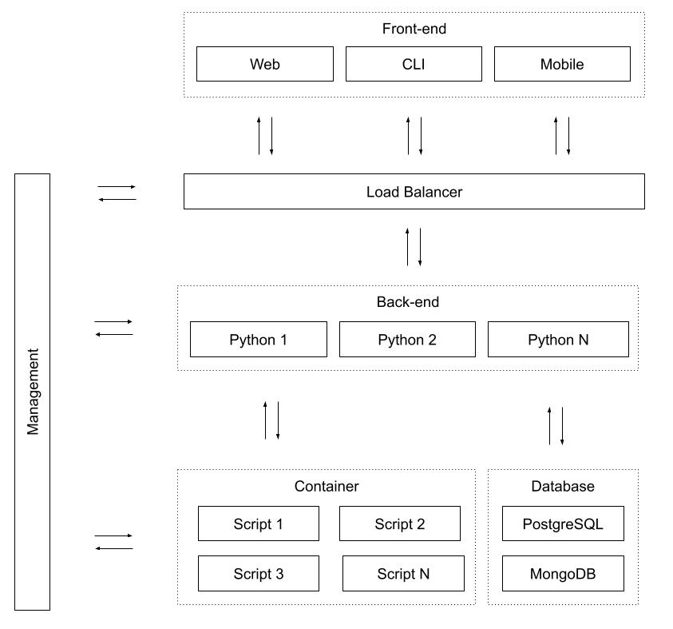

# Walk through the tech stack you used for this project.

## Back-end

For the back-end I decided to use Python, as you said you have been using it in the company.

However, for this kind of application, I’d probably use Golang instead, since most cloud native technologies are using it. Also, it reduces infrastructure costs because of the low memory footprint and fast cpu speed.

## Front-end

The CLI I kept with the original Node.js application. But Rust might be another good option here, since it’s compiled, and easier to share release applications.

## Infrastructure

Docker is the main back-end execution engine. Everything is isolated inside containers and the operating system image is pretty much the original one.

Since it’s a single machine, I didn’t use any orchestration engine, such as Kubernetes or Docker Swarm.

To deploy the application I use Docker Compose, since it makes it easier to deploy multiple containers.

# Describe the various steps you went through to deploy your API to AWS. Please be specific.

To make the process easy, I packed everything inside a container and used Docker Compose to run it.

Please, refer to the infrastructure [README](infra/README.md) for more information.

This step can be improved by using CI/CD techniques.

# Briefly describe the tests you conducted.

I deployed many different scripts during my tests. These deployments were manual, and a better approach would be to create an infrastructure using CI/CD that runs tests before prod deployments.

Example scripts can be found in the CLI folder [README](cli/README.md).

I had the intention to create unit tests for some parts of the code, but the time wasn’t enough and this wasn’t a requirement. But I want to point out the importance of automated tests, especially for back-end applications.

# This challenge relied on two major assumptions. Discuss what changes you'd make/require if we relaxed these assumptions.

## Assumption 1: The Python script has no external dependencies

To use dependencies, initially two options are available.

### Pre-build image

Build an image with all dependencies installed. This is probably the safest option, since all dependencies are evaluated before adding them to the container.

### Requirements

Create an image every time the user makes a deployment and install its dependencies. This is probably not safe, and might be expensive.

## Assumption 2: The server that hosts the API endpoint, and the instance that runs the workload are the same machine.

We should use an orchestration engine, such as Kubernetes or Docker Swarm.

These orchestration engines usually provide an API endpoint to access its functionality. This API endpoint can be secure and accessed only internally by our API server.

In the following image, we can see an architecture where the container engine is completely isolated from the rest of the infrastructure, adding a new layer of security and organization.

.

Also the back-end API as well as any database are isolated each in its own private sub-network.
